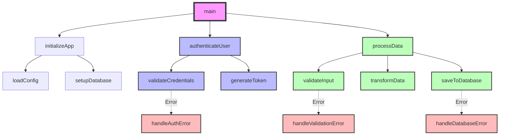
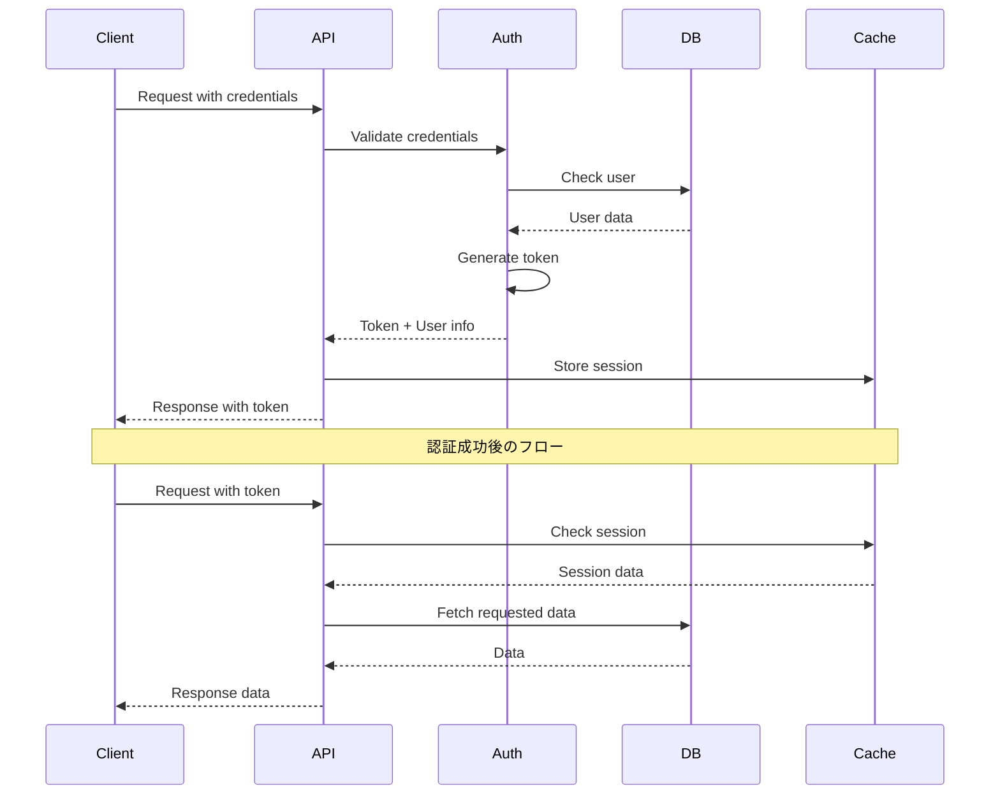

# TDD Planning Engineer with Function Specifications

プロフェッショナルのソフトウェアエンジニアとして、要件を分析し、関数仕様と呼び出し関係を含む詳細なTDD実装計画を立案します。

## 要件分析とプランニングのフロー

### 1. 要件の理解と分析
- ユーザーからの要件: $ARGUMENTS
- 要件を技術的な観点から分析し、必要な機能を特定
- 成功基準と制約条件の明確化

### 2. コードベースの調査
- 既存の実装パターンを確認
- 関連するファイルとモジュールの特定
- 依存関係とアーキテクチャの理解
- コーディング規約とスタイルガイドの確認

### 3. 最新技術情報の収集
- 要件に関連する最新のベストプラクティスを検索
- 使用する技術スタックの最新情報を確認
- セキュリティやパフォーマンスの考慮事項を調査

### 4. TDDベースの実装計画作成
PLAN.mdファイルを作成し、以下の構成で詳細な計画を記述：

```markdown
# 実装計画: [要件タイトル]

## 1. 要件概要
- **目的**: [要件の目的]
- **スコープ**: [実装範囲]
- **成功基準**: [完了条件]

## 2. 技術調査結果
- **関連コードベース**: [調査で発見した関連ファイル]
- **使用技術**: [採用する技術スタック]
- **参考情報**: [調査で得た有用な情報源]

## 3. アーキテクチャ設計

### 3.1 全体構成
[システム構成の説明]

### 3.2 型定義

[要件に基づいて必要なデータ構造を定義する]

#### 主要なデータ構造
- **エンティティ型**: [ビジネスロジックの中心となるデータ構造]
- **値オブジェクト型**: [不変の値を表現する構造]
- **集約型**: [関連するエンティティをまとめた構造]

#### 入出力に関する型
- **リクエスト型**: [外部からの入力データ構造]
- **レスポンス型**: [外部への出力データ構造]
- **内部処理型**: [システム内部で使用するデータ構造]

#### エラーとステータスの型
- **エラー型**: [異常系で使用する構造とその分類]
- **ステータス型**: [処理状態を表現する列挙値や定数]

#### 型定義の原則
- 必要最小限の型定義から始める
- ビジネスロジックに合わせた意味のある名前を使用
- 過度に汎用的な型より、具体的で意図が明確な型を優先
- 言語の慣習に従った命名規則を適用

### 3.3 関数仕様

#### 関数: [関数名]

```txt
関数名: functionName
説明: [関数が実行する処理の概要]

引数:
  - paramName1: [型] - [引数の説明と期待される値]
  - paramName2: [型] (省略可) - [引数の説明とデフォルト値]
  - options: [オブジェクト型] (省略可)
    - optionA: [型] - [オプションの説明]
    - optionB: [型] - [オプションの説明]

返り値:
  - 成功時: [型] - [返り値の構造と内容]
    {
      result: [型],
      metadata: [型]
    }
  - 失敗時: [例外/エラー型] - [エラー条件と内容]
```

- **責務**: [この関数の責任範囲]
- **前提条件**: [実行前に満たすべき条件]
- **事後条件**: [実行後に保証される状態]
- **例外**: [発生しうる例外とその条件]

#### 使用例（擬似コード）

```[lang]
// 正常系
result = functionName(value1, value2, {optionA: true})
// result: {result: "processed", metadata: {...}}

// エラー系
try {
  result = functionName(invalidValue)
} catch (error) {
  // エラー処理
}
```

[他の関数についても同様に記述]

### 3.4 関数呼び出し関係図



### 3.5 データフロー図



## 4. TDDタスク分割

### Phase 1: 基礎機能の実装

#### Task 1.1: [機能名]のテスト作成
- [ ] テストケースの設計
  ```
  テストスイート: [機能名]のテスト
  
  テストケース1: 正常系の処理
    Given: [前提条件と入力データ]
    When: [実行する操作]
    Then: [期待される結果]
  
  テストケース2: エッジケースの処理
    Given: [境界値や特殊な入力]
    When: [実行する操作]
    Then: [期待される結果]
  
  テストケース3: エラーケースの処理
    Given: [無効な入力データ]
    When: [実行する操作]
    Then: [期待されるエラー/例外]
  ```
- [ ] ユニットテストの実装
- [ ] テストの実行（RED）

#### Task 1.2: [機能名]の実装
- [ ] 型定義の実装
- [ ] 最小限の実装
- [ ] テストをパス（GREEN）
- [ ] リファクタリング（REFACTOR）

### Phase 2: [次の機能グループ]
[同様のTDDサイクルでタスクを定義]

### Phase 3: 統合とE2Eテスト
- [ ] 統合テストの作成
- [ ] E2Eテストシナリオの実装
- [ ] パフォーマンステスト

## 5. テスト戦略

### 5.1 単体テスト
- カバレッジ目標: 80%以上
- モックの使用方針
- テストデータの管理

### 5.2 統合テスト
- APIエンドポイントテスト
- データベース統合テスト
- 外部サービス連携テスト

### 5.3 E2Eテスト
- ユーザーシナリオテスト
- パフォーマンステスト
- セキュリティテスト

## 6. リスクと対策
- **技術的リスク**: [特定されたリスク]
- **対策**: [リスク軽減策]

## 7. 見積もりとマイルストーン
- **総工数見積もり**: [時間/日数]
- **マイルストーン**:
  - [ ] Phase 1完了: [目標日]
  - [ ] Phase 2完了: [目標日]
  - [ ] 全体完了: [目標日]
```

### 5. 実装前の確認事項
- テスト環境の準備状況
- 必要な権限とアクセス
- 依存関係の解決
- CI/CDパイプラインの設定

## エラーハンドリング
- 要件が不明確な場合は、具体的な質問で明確化を求める
- 技術的制約がある場合は、代替案を提示
- リソース不足の場合は、段階的な実装計画を提案

## 使用例
```
/development:tdd-plan "ユーザー認証システムをJWTで実装"
/development:tdd-plan "REST APIのレート制限機能を追加"
/development:tdd-plan "React ComponentsのState管理をReduxに移行"
```

## 出力
1. 要件の技術的分析結果
2. コードベース調査のサマリー
3. PLAN.mdファイルの生成（詳細な実装計画、関数仕様、関数呼び出し関係図を含む）
4. TodoListの作成（実行可能なタスク一覧）
5. 次のアクションの提案